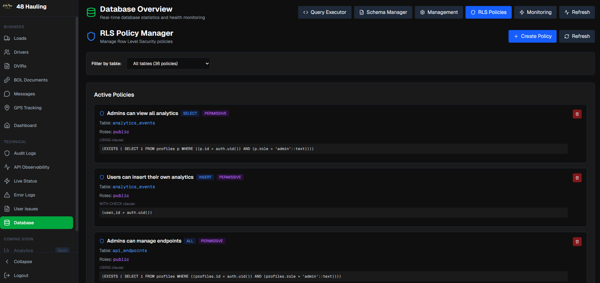
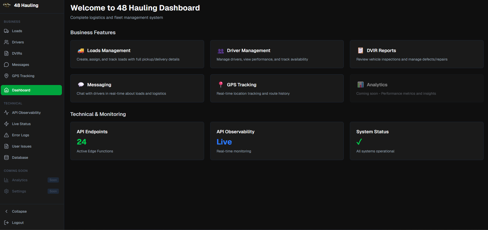

# 48 Hauling — Web App

<p align="center">
  
</p>

Fast, reliable hauling at scale. This repo contains the 48 Hauling marketing site, driver application, and Dev Ops overview built on Next.js (App Router) and Tailwind.

## Highlights
- Quote requests with photo uploads (modal) and API endpoint.
- Driver application with resume upload and dynamic, multi‑entry sections (employment, accidents, convictions).
- Dev Ops page showing integrations and engineering capabilities.
- Sidebar layout across non‑home pages; clean, single‑page home with anchored sections.
- Crisp brand UI with Tailwind, Framer Motion, and Lucide icons.

<p align="center">
  
  
  <br/>
  <em>Integrations and internal tools that keep crews moving.</em>
  
</p>

## Tech Stack
- Next.js 14 (App Router) + React 18 + TypeScript
- Tailwind CSS + PostCSS
- Framer Motion + Lucide React

## Quickstart
```bash
# from repo root
cd website
npm install
npm run dev   # http://localhost:3000
```

Production preview:
```bash
npm run build
npm run start  # defaults to :3000 (use -p to set a port)
```

## Project Structure
```
website/
  app/
    (withNav)/          # shared sidebar layout
      devops/           # /devops page
      drivers/          # /drivers page
    api/
      drivers/route.ts  # POST /api/drivers
      quote/route.ts    # POST /api/quote
    layout.tsx          # root layout + metadata
    page.tsx            # home (hero, services, stats, industries, about, contact)
  components/ui/        # Button, Card primitives
  public/
    48Hauling_Vector.svg
    trucks/             # gallery assets
    devops/             # devops screenshots
  package.json          # scripts: dev/build/start/lint
  tailwind.config.ts    # Tailwind setup
```

## Key Commands
- `npm run dev` — start local dev server with HMR.
- `npm run build` — production build (Vercel‑ready).
- `npm run start` — serve the optimized build.

## Configuration
No required env vars for basic usage. If you want to persist form data:
- Wire `/api/quote` and `/api/drivers` to email (Resend/SendGrid) or storage/DB (Vercel Blob/S3, Postgres/Mongo).

## Deployment
- Designed for Vercel. Import the `website` folder. Defaults work out of the box.
- Static assets are served from `website/public`.

## Admin Portal
- External portal: https://web-panel-indol.vercel.app/login
- All “Admin Portal” links/buttons redirect to the address above.

## Contact
- Email: Javier@48hauling.com
- Office: (480) 550‑1733
- Dispatch: (602) 980‑2192

---
Own the jobsite schedule. Show up, do it safely, zero headaches.
